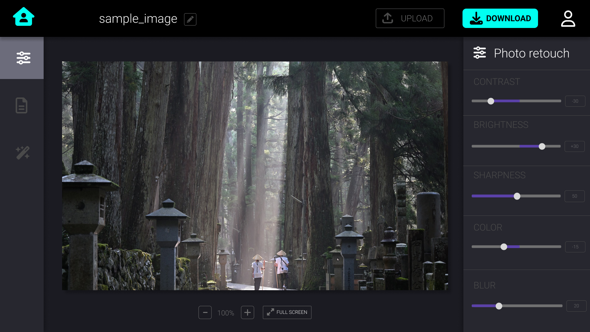

# **Funkcionális specifikáció**

## 1. A rendszer céljai és nem céljai

- Az alkalmazásunk célja közé tartoznak a következők:
  - Egyszerű képszerkesztés
  - Innovatív megoldások alkalmazása
  - Dekoratív design
  - Reponzív felület
  - Mindig rendelkezésre álljon
  - Ingyenes legyen
  - Pár kattintás által tudjon szöveget kinyerni egy képből
  - Tudjon minél több formátumba exportálni
  - Zöld hátteret tudjon eltávolítani
- Az alkalmazásunknak nem célja hogy:
  - Más platformokon működjön natív módon
    - Pl. Android, iOS
  - Több nyelvű felhasználói felületet tartalmazzon, hiszen egyszerű és érthető lesz a felület e nélkül is
  - A felhasználó képeit lementse véglegesen, hiszen az sem etikus, sem biztonságos nem lenne, a GDPR-ra nézve, de ezekről lentebb, a megszorítások résznél lesz bővebb leírás.
  - Professzionális képek előállítása, hiszen akik ilyet akarnak ott vannak a nagy gyártók szoftverei.
    - Az alkalmazásunk az egyszerűségre és gyorsaságra törekszik.

---

## 2. Jelenlegi helyzet leírása

- A megrendelő szeretné, ha a képszerkesztés minél gyorsabb, egyszerűbb és innovatívabb lenne.
- A megrendelő szeretné ha mindez ingyenes lenne és egy mindenki számára elérhető weboldalon meg lehetne tekinteni és használni.
  - A weboldal neve legyen egyszerű és jól csengő, hogy mindenki könnyen meg tudja jegyezni.
- Azt szorgalmazza, hogy legyenek külön felületek az egymástól elkülöníthető funkcionalitásokra:
  - Pl. magára a képszerkesztésre egy, a háttér eltávolítására egy illetve külön oldal/fül a szöveg kinyerésére, illetve annak exportálására.
- A felhasználó le tudja tölteni az általa szerkesztett képet.
- A felhasználó le tudja tölteni a konvertált dokumentumot ami az általa feltöltött képből kinyert szöveget tartalmazza.
- Továbbá, az alkalmazás egy piaci rés betöltésére lenne alkalmas

---

## 3. Vágyálom rendszer leírása

- A rendszerünk, mint azt fentebb is említettem három képekhez kötődő funkcionalitással fog rendelkezni:
  - A felhasználó fel tudja majd javítani a képeit:
    - Pl. kontraszt, fényesség (brightness), élesség (sharpness) és egyebek változtatása, feljavítása
    - Lenne külön opció _preset1_-ek mentésére is, amit később bármikor be tud tölteni, ha beírja az általa kiválasztott felhasználónevet amit az oldal bekér az alkalmazás indulásakor a kezdő képernyőn.
  - El tudja majd távolítani a zöld hátteret a képei mögül, ami mögé majd esetlegesen be tud szúrni/rakni egy másik, általa kiválasztott képet.
  - Ki tudja majd nyerni a szöveget a képeiből:
    - Pl. lefotóz egy számlát, amit dokumentálni szeretne, ezáltal befotózza azt, feltölti az oldalra, az pedig kinyeri belőle a szöveget.
      - Mindezt opcionálisan ki tudja exportálni egy külső formátumba2 mint például _PDF_, _TXT_, _DOC_ és egyebek.
- A felhasználó le tudja majd menteni az általa szerkesztette, feljavított képet, illetve a kigenerált dokumentumokat.

---

## 4. A rendszerre vonatkozó külső megszorítások: pályázat, törvények, rendeletek, szabványok és ajánlások felsorolása

- A rendszernek/alkalmazásnak a következő megszorításokat kell tartalmaznia:
  - Nem szabad hogy felhasználó adatokat tároljon, csupán átmenetileg tárolhat képeket, a műveletek elvégzéséig.
    - Csak a felhasználó által egyedileg kiválasztott felhasználónév tárolására van engedély, ami a későbbi preset-ek beazonosítására fog az alkalmazás használni.
  - Tiltott a felhasználó azonosítására alkalmas sütik használata.
  - Innovatív technológiákat kell használnia, ami lehetőleg minden modern böngészőben működik
  - Nem szabad, hogy lefagyjon az alkalmazás
  - Tilos trágár, explicit felhasználónevet választani a felhasználónak a bejelentkezésnél
  - Tilos tárolnia a felhasználó képeit, hiszen az a GDPR bizonyos szabályaival szembe menne.

---

## 5. Jelenlegi üzleti folyamatok modellje

- Telepített képszerkesztő használata:
  - A legtöbb képszerkesztőt le kell tölteni és telepíteni
  - A legtöbb fizetős és drága
  - A legtöbbet egy ideig lehet használni utána fizetni kell
  - Nem átlátható így a felhasználónak a legtöbb idejét az veszi el hogy az alkalmazás ki kell ismernie
  - Illetve ha a felhasználónak nincs erős gépe akár le is fagyhat az alkalmazás ami az addigi változtatások kárára mehet

---

## 6. Igényelt üzleti folyamatok modellje

- Online elérhető, ingyenes rendszer létrehozása
  - Webes megjelenés mind mobilról (hordozhatóság) mind pedig számítógépről
  - Legtöbb operációs rendszeren lehessen használni
  - Ingyenes legyen a rendszer ne legyen fizetős része
  - Mindig elérhető legyen
- Átlátható design kialakítása a weboldalon
  - Funkciók elkülönítése egymástól
  - Elegáns design kialakítása
  - Letisztult , sima, de elegáns színű háttér
- Egyszerű betűtípus, betűszín és ikonok alkalmazása
  - A weboldalon lévő ikonok, betűtípusok és színek egyszerűek de még elegánsak legyenek

---

## 7. Követelménylista

| Követelmény azonosító |                                Leírás                                |
| :-------------------: | :------------------------------------------------------------------: |
|          K01          |   Felhasználó/vendég be tudjon lépni a felhasználónevét használva    |
|          K02          |           Telefonon és számitógépen is lehessen használni            |
|          K03          |              Minden internetes keresőn elérhető legyen               |
|          K04          |                          Reszponzív dizájn                           |
|          K05          |                           Dekoratív dizájn                           |
|          K06          |                   Mindig elérhető legyen az oldal                    |
|          K07          |                 Egyszerűen legyen kezelhető az oldal                 |
|          K08          |             Az oldal alkalmazkodjon a kijelző méretéhez              |
|          K09          |          A felhasználó tudjon képeket feltölteni az oldalra          |
|          K10          |                  Tudja a kép kontrasztját javítani                   |
|          K11          |                  Tudja a kép élességét feljavítani                   |
|          K12          |                  Tudja a kép homályosságát javítani                  |
|          K13          |                   Tudja a fényességet csökkenteni                    |
|          K14          |                     Tudja a fényességet növelni                      |
|          K15          |                      Át tudja méretezni a képet                      |
|          K16          |                 Ki tudjon nyerni a képből karaktert                  |
|          K17          | A felhasználó át tudja convertálni a képet: doc pdf stb. formátummá  |
|          K18          |               A felhasználó le tudja szedni a hátteret               |
|          K19          |          A felhasználó hozzá tudjon adni hátteret a képhez           |
|          K20          |          A felhasználó le tudja menteni a saját preset-jeit          |
|          K21          | A felhasználó le tudja menteni az elkészült képet a változtatásokkal |

---

## 8. Használati esetek

- Felhasználó:
  - Beléphet az oldalra a felhasználónevével
  - Fel tud képeket tölteni
  - Tudja szerkeszteni a képeket:
    - Tudja javítani a kép:
      - Kontrasztját
      - Élességét
      - Homályosságát
      - Fényességét
  - Át tudja méretezni a képet
  - Karaktert tud kinyerni a képből
  - Át tudja konvertálni (doc, pdf, docx, stb.)
  - Le tudja szedni a hátteret
  - Hozzá tud adni hátteret
  - Preset-eket tud lementeni
  - A változtatásokkal elkészült képet le tudja menteni
- Admin:
  - Meg tudja csinálni azon dolgokat mint a felhasználó
  - Tud változtatni a kódon
  - Tud bugfix-elni ha szükséges
  - Illetve hozzá tud adni más funkciót akár

---

## 9. Megfeleltetés, hogyan fedik le a használati esetek a követelményeket

- Ha sikerül beolvasni a képet, akkor jobb oldalon különböző tulajdonságokat  
  lehet állítni, ezek: contrast, brightness, sharpness. 
  Alul pedig lehet nagyítani, és kicsinyíteni is, illetve  
  full sceenre is lehet állítani.

---

## 10. Képernyő tervek

- Az alkalmazás három felületet fog tartalmazni3, amik egyetlen oldalon lesznek megvalósítva, és onnan lehet váltogatni majd az oldalsó fülek segítségével, mint azt a lenti képen láthatjuk is.
  - A jelenlegi, amin van az a képszerkesztésre van
  - A második az a szöveg kinyerésre
  - A harmadik pedig a háttér eltávolításra való felületet hozza be ha rákattintunk
- Az alkalmazás kezdőoldala:
  

---

## 11. Forgatókönyvek

- Futási időben egy szereplő figyelhető meg. Az alkalmazást elindítva megjelenik egy üres kezelőfelület,  
  ezután be lehet olvasni a képet. Felül láthatóak ikonok, amikkel le lehet tölteni,  
  illetve fel lehet tölteni a képet. Bejelentkezésre is lehetőség van.

---

## 12. Funkció – követelmény megfeleltetés

- A funkció magát a projektnek a működését, funkcióját mutatja be, míg a követelmény 
  azt, hogy hogyan kell használni,és azt, hogy mik a követelményei annak, hogy elindítsuk 
  a programunkat. Ahhoz, hogy használni lehessen az appot be kell jelentkezni.

---

## 13. Fogalomszótár

1. Egy preset, az amikor a felhasználó beállítja a különböző képszerkesztési beállításokat, s azokat lementi, hogy később is be tudja majd tölteni és felhasználni őket.
2. Ezek különböző elektronikus szöveges dokumentum formátumok, a PDF-et hivatalos dokumentumok továbbítására szokták használni, mivel alapvetően nem szerkeszthető. A DOC pedig a Microsoft Word szöveges dokumentumainak a formátumai, a TXT pedig egyszerűen csak egy .txt kiterjesztésű szöveges fájl.
3. A különböző felületeken különböző jobb oldali panelsáv fog megjelenni, az adott felület beállításainak megfelelő módon.
