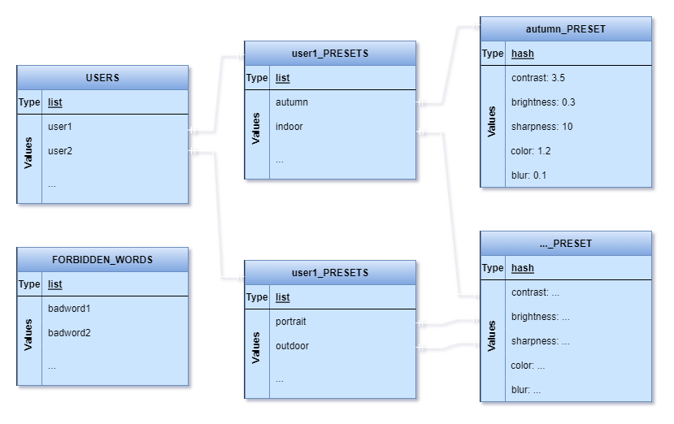

# **Rendszerterv**
## 1. A rendszer célja
---
## 2. Projektterv
---
## 3. Üzleti folyamatok modellje
---
## 4. Követelmények
---
## 5. Funkcionális terv
---
## 6. Fizikai környezet
---
## 7. Absztrakt domain modell
---
## 8. Architekturális terv
---
## 9. Adatbázis terv
* A szavak tárolására NoSQL adatbázis rendszert fog használni a rendszer, azon belül is a Redis-t
* Mivel a Redis lehetőséget ad ingyenes szerver és adatbázis host-ra, ezért a Redis Cloud online szolgáltatását használjuk az adatbázis hostol-ására.
* Az alkalmazás kihelyezése után, nagy eséllyel elő lesz fizetve egy nagyobb plan, ami több tárhelyet ad.
* A webalkalmazás három fő adatszerkezetet (mivel a Redis egy memória-beli kulcs-érték adatbázis) fog tartalmazni:
    * Egy csúnya szavakat tartalmazót, hogy a felhasználó ne használhasson csúnya, tiltott, obszcén szavakat sem felhasználónévként, sem az lementendő kép/dokumentum neveként.
    * Egy felhasználóneveket tartalmazó listát, ami csupán a nevek tárolására hivatott.
    * Minden névhez egy listát, ami a felhasználó által elnevezett és lementett preset-ek nevei tartalmazza.
    * Minden preset-hez egy hash-t, amiben tárolva vannak a kívánt, adott képen alkalmazandó, betöltendő beállítások.
        * Mint például kontraszt (*contrast*), fényesség (*brightness*), élesség (*sharpness*), szín intenzitása (*color*) és homályosság (*blur*)
* Az adatbázis eljárások között szerepelni fog az újonnan regisztrált felhasználók bevitele az adatbázisba, illetve presetek létrehozása és perzisztálása.
    * A fentieken kívül pedig, le lesznek kérve, illetve filterezve is lehetnek az elemek.
* Az adatbázis modelljének diagrammja a következő képpen néz ki: 

---
## 10. Implementációs terv
---
## 11. Tesztterv
---
## 12. Telepítési terv
* Adatbázis telepítése
  * Fejlesztés alatt:
    * Mivel Redis-t használ az alkalmazás, van lehetőség ingyen adatbázis host-olásra, redis cloud-ot használva, egészen 30MB tárhelyig, ami a fejlesztésre bőven elég, hiszen csak szavakat tárolunk.
  * Deploy után:
    * Az alkalmazás kihelyezése után ajánlatos egy fizetett plan-re váltani a Redis Cloud-ban, ami lehetővé teszi több konkurens használatot, illetve nagyobb tár kapacitást.
* Szerver telepítés
  * Fejlesztés alatt:
    * A frontend esetében elegendő ha egy Visual Studio Code-beli live server-t nyitunk meg
    * A backend-nél pedig elegendő a fő *app.py* fájl futtatása
  * Deploy után:
    * Nincs szükség telepíteni sem a frontend-et, sem pedig a backend-et, hiszen a frontend-et futtatását a *Github Pages* fogja megoldani, a backend-et pedig a *render.com* weboldal.
* Alkalmazás telepítése
  * Fejlesztés alatt:
    * Nincs szükség telepítésre, hiszen a fejlesztő környezetből (*Visual Studio Code*) van lehetőség live server nyitására is, vagy csak egyszerűen megnyitjuk az index.html oldalt egy tetszőleges webböngészőben.
  * Deploy után:
    * Elegendő csak az előre meghatározott github-os linket megnyitni, ami automatikusan behozza és betölti a szolgáltatást.
---
## 13. Karbantartási terv
