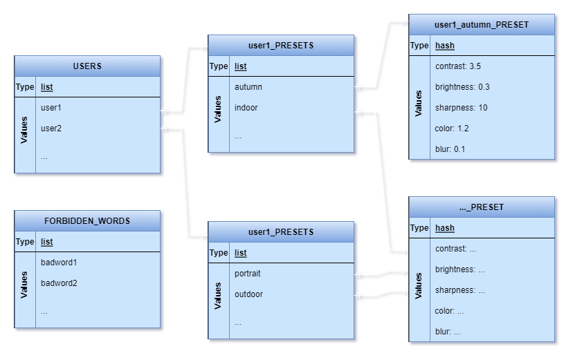

# **Rendszerterv**
## 1. A rendszer célja
---
## 2. Projektterv
### Projektszerepkörök, felelősségek:
* Scrum master: Varga József-Márk, Bódi András, Cserés Gábor
* Product owner: Varga József-Márk, Bódi András, Cserés Gábor

### Projektmunkások és felelőségek:

* Backend munkálatok:
    * Varga József-Márk
         * Feladatuk a funkciók létrehozása illetve a preset-ek elmentése
* Frontend:
    * Bódi András, Cserés Gábor
         * Feladatuk az elkészült képernyőtervek alapján létre hozni a weboldal megjelenését
### Ütemterv:

|          Funkció        |Feladat|Prioritás|Becslés|Aktuális becslés|Eltelt idő|Hátralévő idő|
|          :----:         |:----: |  :----: | :----:|     :----:     |  :----:  |    :----:   |
|Követelmény specifikáció |       |0        |7      |7               |7     |       0     |
|Funkcionális specifikáció|       |0        |7      |7           |7     |   0     |
|       Rendszerterv      |       |0        |7      |7           |7     |   0     |
|         Frontend        |       |2        |-      |-               |0     |   -     |
|         Backend         |       |2        |-      |-           |0     |   -     |

---
## 3. Üzleti folyamatok modellje
* Üzleti szereplők
    * **Felhasználó**: ez alatt értetik bármely felhasználó, akármilyen korcsoportban, aki az alkalmazást használni akarja.
    * **Admin**: akinek jogosultsága van a rendszer karbantartására és szerkesztésére
    * **Tesztelők**: lehetnek akár fejlesztők (az alpha tesztelés esetében), vagy az alkalmazás béta tesztelői, akik véletlenszerűen lettek kiválasztva a felhasználói bázisból.
* Üzleti folyamatok:
    * Fénykép feltöltése a platformra, amit az adott felhasználó szerkeszteni, manipulálni szeretne.
    * Manipulációs mód kiválasztása, legyen az a kép feljavítása, háttér eltávolítása avagy szöveg kinyerése és exportálása az előre megadott kimeneti formátumok egyikébe.
    * Szerkesztett kép vagy dokumentum letöltése.
* Üzleti entitások:
    * Maga a webalkalmazás (mivel maga az alkalmazás csekély méretű)
* Szemléltető folyamatábra: 

---
## 4. Követelmények
* Funkcionális követelmények:
    * Felhasználó/vendég be tudjon lépni a felhasználónevét használva
    * Telefonon és számitógépen is lehessen használni
    * Minden internetes keresőn elérhető legyen
    * Mindig elérhető legyen az oldal
    * Egyszerűen legyen kezelhető az oldal  
    * Az oldal alkalmazkodjon a kijelző méretéhez
    * A felhasználó tudjon képeket feltölteni az oldalra
    * Tudja a kép kontrasztját javítani 
    * Tudja a kép élességét feljavítani 
    * Tudja a kép homályosságát javítani
    * Tudja a fényességet csökkenteni
    * Tudja a fényességet növelni
    * Át tudja méretezni a képet 
    * Ki tudjon nyerni a képből karaktert 
    * A felhasználó át tudja convertálni a képet: doc pdf stb. formátummá
    * A felhasználó le tudja szedni a hátteret  
    * A felhasználó hozzá tudjon adni hátteret a képhez
    * A felhasználó le tudja menteni a saját preset-jeit
    * A felhasználó le tudja menteni az elkészült képet a változtatásokkal

* Nem funkcionális követelmények:
    * Felhasználónak ne lehessen a felhasználó nevén kívűl mást eltárolni, illetve felhasználó ne tárolhasson preset-eken kívűl más adatot
    * Felhasználót ne lehessen azonosítani
    * Nem szabad, hogy lefagyjon az alkalmazás
    * Tilos trágár, explicit felhasználónevet választani a felhasználónak a bejelentkezésnél
    * Ne lehessen tárolni a felhasználó képeit, hiszen az a GDPR bizonyos szabályaival szembe menne.

* Törvényi előírások, szabványok:
    * GDPR-nek való megfelelés.

---
## 5. Funkcionális terv
---
## 6. Fizikai környezet
---
## 7. Absztrakt domain modell
---
## 8. Architekturális terv
* A webalkalmazásunkban lesz egy elkülönített frontend illetve egy backend.
    * Az alkalmazás frontend részen a HTML, JavaScript és CSS hármas kombinációját fogja alkalmazni
    * Backend részen a python nyelvbeli *Flask* framework lesz használva a Rest API kiépítésére, illetve további külső szolgáltatásokat, modulokat a funkcionalitások kielégítése végett.
* A frontend tehát HTML-t fog használni az elemek összefűzésére, CSS-t az elemek stilizálására, JavaScript-et az elemek manipulálására és a backend-del való kommunikálásra.
* A backend pedig a Flask keretrendszerre fog épülni, ami fogja még használni továbbá a Redis, openCV, Pillow és egyéb konvertáló python modulokat.
* Utóbbi lehetővé fogja tenni a különböző rétegek szétválasztását (model, nézet, vezérlő - MVC architekturális minta).
    * A backend-en belül például szét vannak választva az app (controller), üzleti logika (service) és a perzisztencia (repository) rétegek.
* Az események kezelésében mint például slider-ek értékei, mozgatása, panelek közti váltás stb. a JavaScript-beli eseménykezelést fogjuk használni.
* Az adatok tárolására, perzisztálására egy NoSQL adatbázist fog használni az alkalmazás, azon belül is a Redis-t.
* A weboldal biztonságát az biztosítja, hogy nincsenek semmilyen harmadik féltől származó sütik használva, amikkel azonosítani lehetne a felhasználót, illetve nincsenek is ilyen sütik elküldve a backendtől.
    * Továbbá, mivel nem tárol az alkalmazás semmilyen felhasználói adatot explicit módon, ezért nincsenek GDPR szabályszegések sem.
---
## 9. Adatbázis terv
* A szavak tárolására NoSQL adatbázis rendszert fog használni a rendszer, azon belül is a Redis-t
* Mivel a Redis lehetőséget ad ingyenes szerver és adatbázis host-ra, ezért a Redis Cloud online szolgáltatását használjuk az adatbázis hostol-ására.
* Az alkalmazás kihelyezése után, nagy eséllyel elő lesz fizetve egy nagyobb plan, ami több tárhelyet ad.
* A webalkalmazás három fő adatszerkezetet (mivel a Redis egy memória-beli kulcs-érték adatbázis) fog tartalmazni:
    * Egy csúnya szavakat tartalmazót, hogy a felhasználó ne használhasson csúnya, tiltott, obszcén szavakat sem felhasználónévként, sem az lementendő kép/dokumentum neveként.
    * Egy felhasználóneveket tartalmazó listát, ami csupán a nevek tárolására hivatott.
    * Minden névhez egy listát, ami a felhasználó által elnevezett és lementett preset-ek nevei tartalmazza.
    * Minden preset-hez egy hash-t, amiben tárolva vannak a kívánt, adott képen alkalmazandó, betöltendő beállítások.
        * Mint például kontraszt (*contrast*), fényesség (*brightness*), élesség (*sharpness*), szín intenzitása (*color*) és homályosság (*blur*)
* Az adatbázis eljárások között szerepelni fog az újonnan regisztrált felhasználók bevitele az adatbázisba, illetve presetek létrehozása és perzisztálása.
    * A fentieken kívül pedig, le lesznek kérve, illetve filterezve is lehetnek az elemek.
* Az adatbázis modelljének diagrammja a következő képpen néz ki: 

---
## 10. Implementációs terv
* Mint azt fentebb is említettem, az alkalmazásunk HTML-t, CSS-t, JavaScript-et illetve Python-t fog használni a működéséhez.
    * Ez által minimális, ám bár tisztán MVC-nek nem mondható, MVC architekturális mintát tudunk követni, ahol el tudjuk szeparálni egymástól a modellt, kontrollert és nézetet.
* Függőségek kezelésére nem feltétlen van szükség, illetve python-ban nem is nagyon van lehetőség különböző build tool-ok használatára, mivel az alkalmazásban csupán pár külső python module/library van használva, a *redis*, *jsonify*, *Flask*, *openCV*, *Pillow* és egyéb külső szöveges formátumba konvertáló modulok (pdf, docx, doc stb.), mindez a backend-en belül.
* Alkalmazásunk továbbá 3 különböző réteget fog tartalmazni a backend-en:
    * **Perzisztencia réteg**: ez egy python fájl lesz, ami kezeli a redis adatbázist, mely a következő funkcionalitásokkal fog rendelkezni:
        * Mint például: felhasználó regisztrálása/mentése, preset-ek mentése
    * **Üzleti logika réteg**: ez a réteg fogja végezni a különböző kép-manipulálási műveleteket (szöveg kinyerése, kép feljavítása, háttér eltávolítása)
        * Minden ilyen funkcionalitásnak, service-nek egy vagy több külön python fájl lesz rendelve.
    * **Kontroller**: ez fogja a servicek-hez irányítani a különböző beérkező HTTP kéréseket.
        * Mindezt a frontend, egy library-t használva fogja elérni (pl. *Axios* vagy *fetch API*) és hívni.
* Az előbbieknek köszönhetően pedig, szépen tudjuk követni az Egyszeres Felelősség Elvét (angolul Single Responsibility Principle - a SOLID elvekből az elsőt), ami lehetővé fogja tenni az alkalmazás egyszerűbb és átláthatóbb karbantartását.
---
## 11. Tesztterv
---
## 12. Telepítési terv
* Adatbázis telepítése
  * Fejlesztés alatt:
    * Mivel Redis-t használ az alkalmazás, van lehetőség ingyen adatbázis host-olásra, redis cloud-ot használva, egészen 30MB tárhelyig, ami a fejlesztésre bőven elég, hiszen csak szavakat tárolunk.
  * Deploy után:
    * Az alkalmazás kihelyezése után ajánlatos egy fizetett plan-re váltani a Redis Cloud-ban, ami lehetővé teszi több konkurens használatot, illetve nagyobb tár kapacitást.
* Szerver telepítés
  * Fejlesztés alatt:
    * A frontend esetében elegendő ha egy Visual Studio Code-beli live server-t nyitunk meg
    * A backend-nél pedig elegendő a fő *app.py* fájl futtatása
  * Deploy után:
    * Nincs szükség telepíteni sem a frontend-et, sem pedig a backend-et, hiszen a frontend-et futtatását a *Github Pages* fogja megoldani, a backend-et pedig a *render.com* weboldal.
* Alkalmazás telepítése
  * Fejlesztés alatt:
    * Nincs szükség telepítésre, hiszen a fejlesztő környezetből (*Visual Studio Code*) van lehetőség live server nyitására is, vagy csak egyszerűen megnyitjuk az index.html oldalt egy tetszőleges webböngészőben.
  * Deploy után:
    * Elegendő csak az előre meghatározott github-os linket megnyitni, ami automatikusan behozza és betölti a szolgáltatást.
---
## 13. Karbantartási terv
